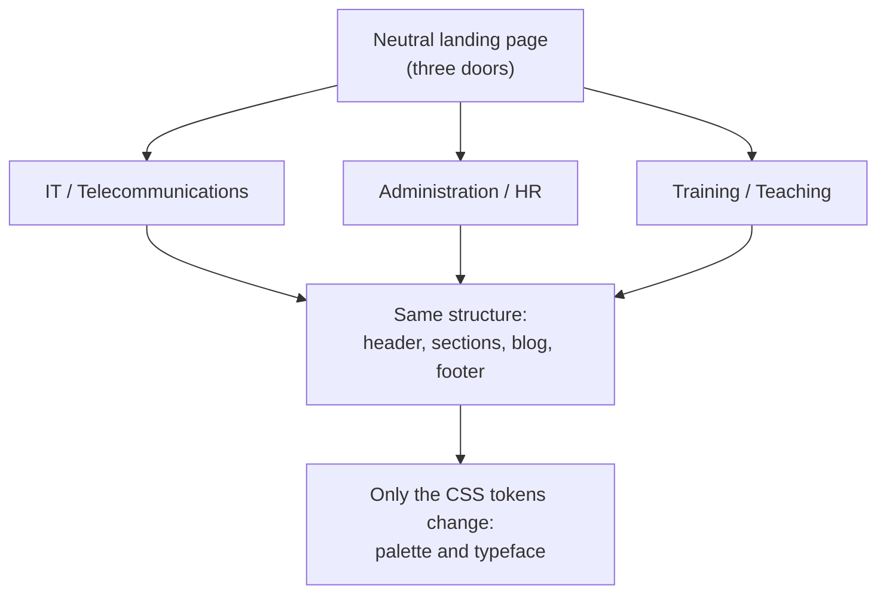
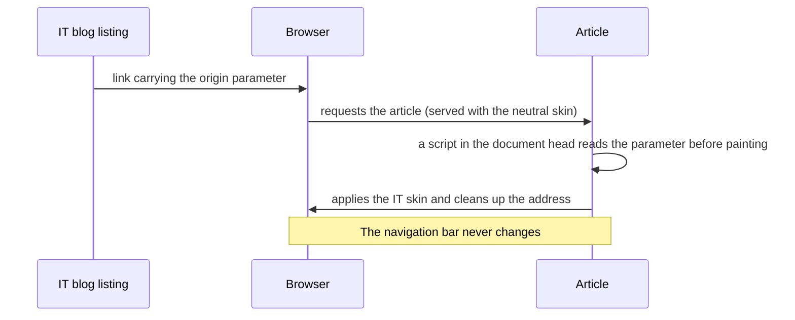

I have three trades and one face. I work with systems and networks, I handle bookkeeping and paperwork, and I teach. A portfolio covering only one of the three would lie by omission; three separate portfolios would mean three maintenance jobs and none of them up to date. This series is about how I got out of that, what I decided and — above all — what I ruled out and why.

I started in early June 2026. The site went live on 22 July. In between there are a fair few decisions you can't see, and those are exactly the ones worth telling: **the value of a portfolio isn't in the list of technologies, it's in the reasoned trade-offs.**

All the code is out in the open: [github.com/carloslb-com/carloslb-com.github.io](https://github.com/carloslb-com/carloslb-com.github.io).

## The principle that ordered everything else

Before writing a single line I set myself a limit: **have something to show, rather than being 99.9% accurate.** A perfect portfolio that never ships isn't a portfolio, it's a folder. And a working motto: **robustness over brevity or cleverness.** Every time I hesitated between the clever solution and the boring one that holds up, the boring one won.

## The stack, and why

| Piece | Choice | Reason |
|---|---|---|
| Generator | Jekyll 4.4.1 (Ruby 3.3.8) | Static site: no database and no admin panel to attack |
| Styles | Dart Sass with `@use` / `@forward` | Real modules; `@import` is deprecated |
| Bilingual | jekyll-polyglot | Two trees (`/` and `/en/`) without duplicating templates |
| Extras | jekyll-feed, jekyll-seo-tag, jekyll-sitemap | The standard set, nothing invented |
| Environment | Ubuntu virtual machine on VirtualBox | Development isolated from my working computer |
| Publishing | GitHub Pages with a custom GitHub Actions workflow | Out of necessity, not preference: more on that in part three |

The important thing about that table is what **isn't** there: no database, no CMS, no third-party services embedded anywhere. A static site is a pile of HTML files. There's no session to steal and no query to inject.

## One person, three worlds

The structure is identical across the three profiles. Header, sections, blog, footer: the same. The only thing that changes is the **skin**: the palette and the typeface.

That's **eight palettes**: four worlds (the three profiles plus the neutral landing page) times two themes, light and dark. I validated them all at high contrast — most of them at AAA level — *before* writing a single line of content. Fixing contrast at the end means redoing everything.

The typefaces are self-hosted as `woff2`. The body text is **Atkinson Hyperlegible**, designed specifically for low vision. Headings change by world: JetBrains Mono for IT, IBM Plex Serif for Administration, Nunito for Training. A typeface says a great deal before the first word is read.

The data — projects, certifications, courses, work history — lives in YAML, following a `key → {es, en}` pattern. Only what actually changes between languages gets translated. A year is a year in both.

### A small decision with large consequences

The profile class lives on the `html` element, not on `body`, alongside the theme attribute. If it lives on `body`, the browser has already started painting by the time you apply the theme, and you get a flash of the wrong palette. With the class at the top, the script runs before there's anything to flash.

Side effect: because both attributes hang off the same element, the palette selectors are concatenated **without a space**. Yes, CSS has its own small print too.

## Colour can depend on JavaScript; navigation cannot

This is the decision I'm proudest of, and the one that ruled out the most.

The requirement was: if you enter the blog through the IT door, the article should *feel* like IT. But an article is a single file, and it can be reached from three places and in two languages.

**Path 1: generate physical versions of the article per context.** Three contexts times two languages is six versions of every article. Unworkable maintenance and duplicate URLs competing with each other. Ruled out.

**Path 2: have JavaScript rebuild the navigation bar on the fly.** More code, more fragile, and without JavaScript the visitor can't navigate at all. Ruled out.

**What I did:** the colour and the typefaces do change according to the door you came through; the navigation bar stays put.

If the script fails, the article shows up in neutral colours and reads perfectly. Nobody is locked out.

Two takeaways from that, which I've already reused elsewhere:

> **When every solution to a requirement is a bad one, sometimes the problem is the requirement, not the solution.**

> **Look for the version that delivers most of the perceived value for a fraction of the cost.** Colour gives you 90% of the sense of being in a different world. A dynamic navigation bar added 10% at enormous cost.

## How I worked on this

I didn't do it alone. I used an AI assistant as a tool: for reference, for learning Jekyll and Liquid, for diagnosis when something didn't add up, and for organising and tracking the tasks of a project that ran for two months and has a lot of moving parts.

I'm saying so plainly, because hiding it would be the exact opposite of what I stand for. And because the distinction matters: the tool speeds up research and keeps the work organised, but it doesn't make the decisions. The ones above — what to rule out, which requirement to question, where to stop — are mine, and each of them has its reasoning written down. In part three I'll tell you where it got things wrong and how I caught it.

---

**Next:** in part two, why this site doesn't load a single third-party resource, how the contact form works without JavaScript, and which regulations actually apply to a personal website — considerably fewer than the templates would have you believe.
