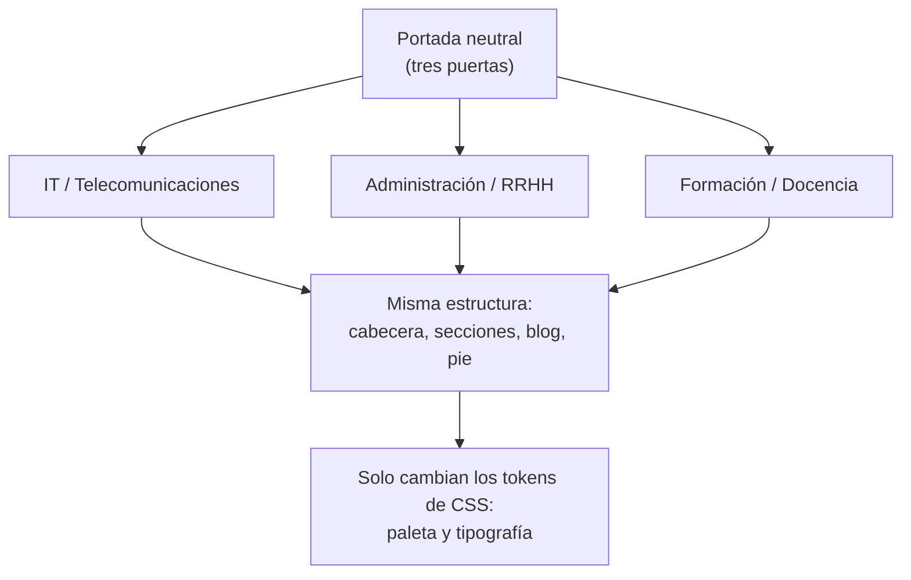
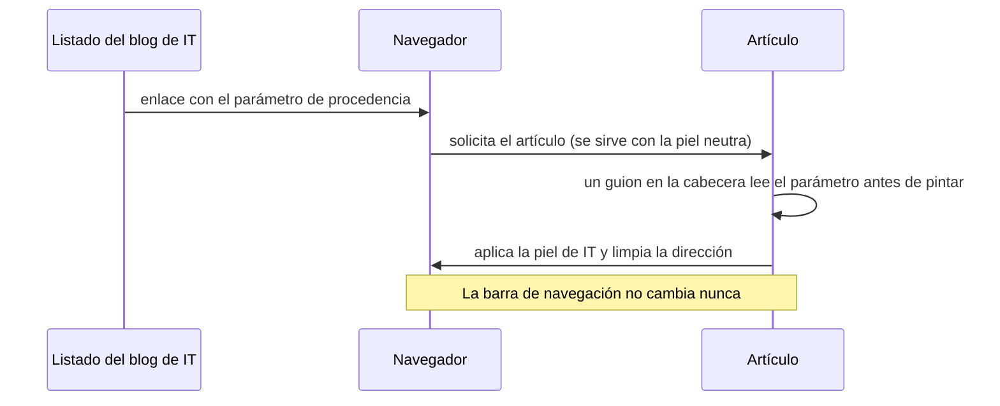

Tengo tres oficios y una sola cara. Trabajo con sistemas y redes, llevo contabilidad y trámites, y doy formación. Un portafolio que contara solo uno de los tres mentiría por omisión; tres portafolios separados serían tres mantenimientos y ninguno al día. Esta serie cuenta cómo salí de ahí, qué decidí y —sobre todo— qué descarté y por qué.

Empecé a primeros de junio de 2026. El sitio se publicó el 22 de julio. En medio hay unas cuantas decisiones que no se ven, que son justo las que quiero contar: **el valor de un portafolio no está en la lista de tecnologías, está en los descartes razonados.**

Todo el código está a la vista: [github.com/carloslb-com/carloslb-com.github.io](https://github.com/carloslb-com/carloslb-com.github.io).

## El principio que ordenó el resto

Antes de escribir una línea me puse un límite: **tener algo que enseñar, no ser preciso al 99,9 %.** Un portafolio perfecto que no se publica no es un portafolio, es una carpeta. Y un lema de trabajo: **robustez por encima de brevedad o ingenio.** Cada vez que dudé entre la solución lista y la solución aburrida que aguanta, gana la aburrida.

## El stack, y por qué

| Pieza | Elección | Razón |
|---|---|---|
| Generador | Jekyll 4.4.1 (Ruby 3.3.8) | Sitio estático: sin base de datos y sin panel que atacar |
| Estilos | Dart Sass con `@use` / `@forward` | Módulos de verdad; `@import` está obsoleto |
| Bilingüe | jekyll-polyglot | Dos árboles (`/` y `/en/`) sin duplicar plantillas |
| Extras | jekyll-feed, jekyll-seo-tag, jekyll-sitemap | Lo estándar, sin inventar |
| Entorno | Máquina virtual Ubuntu en VirtualBox | Desarrollo aislado del equipo de trabajo |
| Publicación | GitHub Pages con flujo propio de GitHub Actions | Por obligación, no por gusto: lo cuento en la tercera parte |

Lo importante de la tabla es lo que **no** hay: ni base de datos, ni CMS, ni servicios de terceros incrustados. Un sitio estático es un montón de archivos HTML. No tiene sesión que robar ni consulta que inyectar.

## Una persona, tres mundos

La estructura es la misma en los tres perfiles. Cabecera, secciones, blog, pie: idénticos. Lo único que cambia es la **piel**: la paleta y la tipografía.

Son **ocho paletas**: cuatro mundos (los tres perfiles más la portada neutral) por dos temas, claro y oscuro. Las validé a alto contraste —la mayoría en nivel AAA— *antes* de escribir una sola línea de contenido. Corregir el contraste al final es rehacerlo todo.

La tipografía va autoalojada en `woff2`. El cuerpo es **Atkinson Hyperlegible**, diseñada específicamente para baja visión. Los titulares cambian por mundo: JetBrains Mono en IT, IBM Plex Serif en Administración, Nunito en Formación. Un tipo de letra dice mucho antes de que se lea la primera palabra.

Los datos —proyectos, certificaciones, cursos, experiencia— viven en YAML, con el patrón `clave → {es, en}`. Se traduce solo lo que cambia entre idiomas. Un año es un año en los dos.

### Una decisión pequeña con consecuencias grandes

La clase del perfil vive en la etiqueta `html`, no en `body`, junto al atributo del tema. Si vive en `body`, el navegador ya ha empezado a pintar cuando aplicas el tema y se ve el destello de la paleta equivocada. Con la clase arriba, el guion se ejecuta antes de que haya nada que destellar.

Efecto secundario: como los dos atributos cuelgan del mismo elemento, los selectores de paleta se concatenan **sin espacio**. Sí, el CSS también tiene su letra pequeña.

## El color puede depender de JavaScript; la navegación, no

Aquí está la decisión de la que más orgulloso estoy, y es la que más cosas descartó.

El requisito era: si entras al blog por la puerta de IT, el artículo debería *sentirse* de IT. Pero un artículo es un solo archivo, y puede alcanzarse desde tres sitios distintos y en dos idiomas.

**Camino 1: generar versiones físicas del artículo por contexto.** Tres contextos por dos idiomas son seis versiones de cada artículo. Mantenimiento inviable y URLs duplicadas compitiendo entre sí. Descartado.

**Camino 2: que JavaScript reconstruya la barra de navegación al vuelo.** Más código, más frágil, y sin JavaScript el visitante se queda sin poder navegar. Descartado.

**Lo que hice:** el color y las tipografías sí cambian según la puerta por la que entraste; la barra de navegación se queda como está.

Si el guion falla, el artículo se ve en neutro y se lee perfectamente. Nadie se queda fuera.

Dos apuntes que me llevo de ahí, y que ya he reutilizado en otros sitios:

> **Cuando todas las soluciones a un requisito son malas, a veces el problema es el requisito, no la solución.**

> **Busca la versión que da la mayor parte del valor percibido por una fracción del coste.** El color da el 90 % de la sensación de estar en un mundo distinto. La barra dinámica añadía un 10 % a un coste enorme.

## Cómo he trabajado esto

No lo he hecho solo. He usado un asistente de inteligencia artificial como herramienta de consulta, de aprendizaje de Jekyll y Liquid, de diagnóstico cuando algo no cuadraba, y de organización y seguimiento de las tareas de un proyecto que ha durado dos meses y tiene muchas piezas.

Lo digo con todas las letras porque esconderlo sería justo lo contrario de lo que defiendo. Y porque el matiz importa: la herramienta acelera la consulta y ordena el trabajo, pero no toma las decisiones. Las de arriba —qué descartar, qué requisito cuestionar, dónde parar— son mías, y cada una tiene su porqué escrito. En la tercera parte cuento en qué se equivocó y cómo lo detecté.

---

**Siguiente:** en la segunda parte, por qué este sitio no carga ni un solo recurso de un tercero, cómo funciona el formulario de contacto sin JavaScript, y qué normativa aplica de verdad a una web personal —que es bastante menos de lo que dicen las plantillas.
