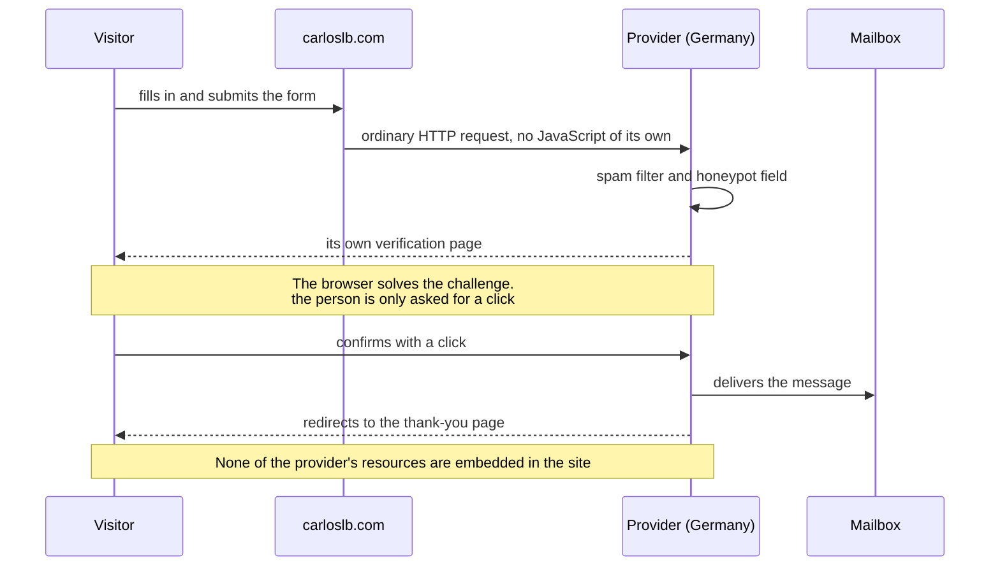
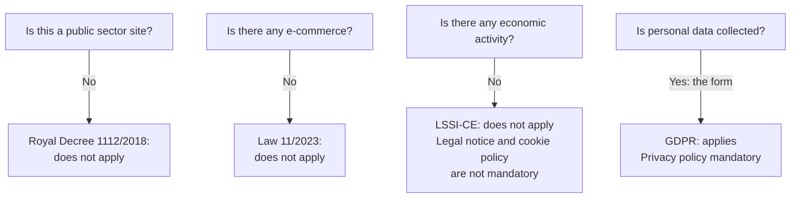

A personal website looks harmless. And yet every typeface served from someone else's service, every library pulled from a content delivery network and every share button is a third party receiving your visitor's IP address, without that person having asked for it or even knowing. This part is about closing those doors, and about the paperwork that follows.

In [part one]({{ '/blog/2026/08/02/como-se-hizo-esta-web-1-tres-mundos/' | relative_url }}) I covered the architecture. Here comes the part you can't see.

## The diagram that gave me away

I was going to write articles with diagrams, so I set up Mermaid. It worked first time: one line pointing at a public delivery network and done.

I spotted the problem while rereading the cookie policy I had just written. That line lived in the base template, which is to say **on every page of the site**. Every visitor, whichever door they came through, was handing their IP address to an outside company in order to load a library that was only needed on articles with a diagram. In other words: none. I was declaring one thing and doing another.

Self-hosting it cost more than it looked:

- The modern bundle uses **code splitting**: the main file imports dozens of chunks from a sibling folder. Copying the single file breaks those imports — which is exactly why an earlier attempt kept "missing files". The fix was to use the classic single-file build.
- **GitHub doesn't publish compiled builds.** The repository holds the source code; the distribution folder lives in the package registry, and that's where the public networks copy it from. You have to go and fetch it from the right place.
- A JavaScript trap that cost me a while: an `import` inside a script that isn't declared as a module throws a syntax error that **kills the entire script**. It isn't that line that fails: nothing runs at all.

The library now lives on the site itself and loads **only on pages that declare they contain a diagram**. I did the same with the maths formulas, with an extra trap: in the current version the fonts don't ship with the package and the loader points to an external network by default. If you don't override that, you've self-hosted the engine and you're still calling out.

The result: **this site doesn't load a single third-party resource.** Typefaces, icons, diagram and formula engines: all served from here.

## No cookies, and that isn't a marketing line

There are no cookies. No analytics, no advertising, no session. So there's no consent banner either, because there would be nothing to consent to.

The only thing stored in your browser is your theme preference, light or dark, in local storage. According to the cookie guidance issued by the Agencia Española de Protección de Datos (the Spanish data protection authority), that counts as technical storage for personalisation **at the user's request**, and is exempt from consent. The difference isn't the mechanism: it's what you use it for.

## The form: sending a message without a server of your own

A static site can't process a form. You need a third party. I compared fourteen services against three criteria: that the data be processed within the European Union, that there be a proper data processing agreement, and that the free tier actually be usable.

That detail about the captcha is the key one: **it is served on the provider's own page, after you press send.** Nothing of theirs is embedded in my site, and the form submits with plain HTML, without any JavaScript of its own.

And the kind of captcha matters as much as where it lives. There's no distorted text to decipher and no traffic lights to point at: the browser solves a cryptographic challenge by itself, and the person is only asked to confirm with a click. That isn't merely convenience, it's accessibility. Image-based captchas are a well-known barrier for people with low vision or those using a screen reader; when the device does the work instead of the person, there's no visual or audio test left to pass.

I ruled out one competitor for processing data in the United States and using cookies, and another — open source and rather elegant — because it required a back end of my own that I don't have.

Two more decisions about the form:

**Data minimisation.** Name, email, subject and message. No phone number, no line of business. If I don't need it in order to reply to you, I don't ask for it. That's what the regulation requires, but it's also common sense: data you don't hold can't leak.

**Disabling the submit button until the form is valid: ruled out on accessibility grounds.** It's a widespread pattern and it's a bad one. A disabled button doesn't explain why it's disabled, and since it can't receive keyboard focus, a screen reader won't even announce it. The person is left facing a form that doesn't respond, with no clue as to why. The browser's native validation already warns them and moves focus to the offending field. Less code and more accessible.

## Which regulations actually apply

This is where my other trade comes in. Before copying a legal template, I worked out what does and doesn't bind me. *This is my reading of my own case, not legal advice: if your situation differs, so does the outcome.*

The result: of the four documents everyone copies, **only one was actually required**. I keep the others by choice — I'd rather err on the side of too much — but with one rule:

> **Keeping the document is not the same as keeping the fiction.**

Legal templates come bloated. The one I downloaded declared processing for commercial, statistical and browsing-analysis purposes. None of that exists here. And declaring processing that doesn't exist does harm twice over: it misinforms the reader, and it commits you to legal bases you don't have. So I pruned everything that wasn't true.

The same goes for the data I publish about myself: name and email address. No national identity document, no home address, no phone number. The template asked for them; the law, in my case, does not. For consistency, the repository commits use GitHub's no-reply forwarding address, and there is no email address in the pages' structured data: address harvesters crawl precisely there.

You can read the outcome in the [privacy policy]({{ '/privacy.html' | relative_url }}) and the [cookie policy]({{ '/cookiespolicy.html' | relative_url }}). I rewrote the latter from scratch, because a template that opens by explaining which cookies it uses is no use for saying that you use none.

---

**Next:** in part three, what nearly broke the site without throwing a single error, how you actually audit accessibility, and why the GitHub Pages builder wasn't an option for me.
