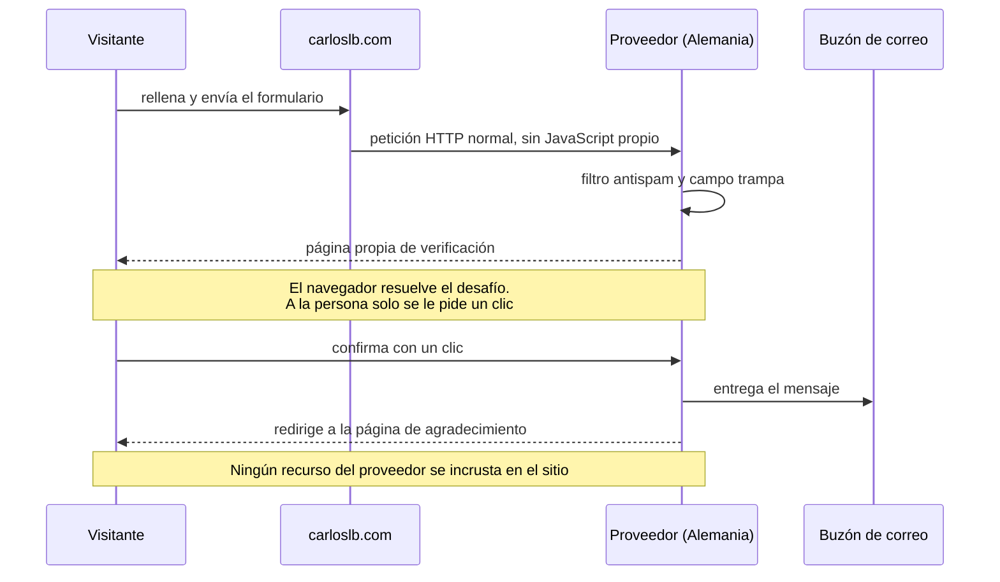
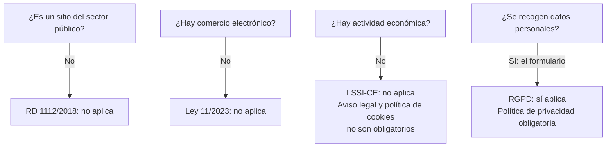

Una web personal parece inofensiva. Y sin embargo, cada tipografía servida desde un servicio ajeno, cada biblioteca traída de una red de distribución y cada botón de compartir es un tercero que recibe la dirección IP de quien te visita, sin que esa persona lo haya pedido ni lo sepa. Esta parte va de cerrar esas puertas, y del papeleo que viene después.

En la [primera parte]({{ '/blog/2026/08/02/como-se-hizo-esta-web-1-tres-mundos/' | relative_url }}) conté la arquitectura. Aquí toca lo que no se ve.

## El diagrama que me delató

Iba a escribir artículos con diagramas, así que monté Mermaid. Funcionaba a la primera: una línea apuntando a una red de distribución pública y listo.

El problema lo vi al releer la política de cookies que acababa de escribir. Aquella línea estaba en la plantilla base, es decir, **en todas las páginas del sitio**. Cada visitante, entrara donde entrara, le estaba entregando su dirección IP a una empresa ajena para cargar una biblioteca que solo hacía falta en los artículos con diagrama. Es decir: cero. Estaba declarando una cosa y haciendo otra.

Autoalojarlo costó más de lo que parecía:

- El paquete moderno usa **división de código**: el archivo principal importa decenas de fragmentos desde una carpeta hermana. Copiar el archivo suelto rompe los imports —esa fue la razón de que un intento anterior «no encontrara archivos»—. La solución fue usar el empaquetado clásico, de archivo único.
- **GitHub no publica las versiones compiladas.** En el repositorio está el código fuente; la carpeta de distribución vive en el registro de paquetes, y de ahí la replican las redes públicas. Hay que ir a buscarla al sitio correcto.
- Trampa de JavaScript que me costó un rato: un `import` en un guion que no está declarado como módulo lanza un error de sintaxis que **mata el guion entero**. No falla esa línea: no se ejecuta nada.

Ahora la biblioteca vive en el propio sitio y se carga **solo en las páginas que declaran tener un diagrama**. Con las fórmulas matemáticas hice lo mismo, con una trampa añadida: en la versión actual, las fuentes tipográficas no vienen en el paquete y el cargador apunta por defecto a una red externa. Si no lo sobrescribes, has autoalojado el motor y sigues llamando fuera.

El resultado: **este sitio no carga ni un solo recurso de un tercero.** Tipografías, iconos, motores de diagramas y de fórmulas: todo servido desde aquí.

## Sin cookies, y no es una frase de marketing

No hay cookies. Ni analítica, ni publicidad, ni sesión. Por tanto no hay banner de consentimiento, porque no habría nada que consentir.

Lo único que se guarda en tu navegador es tu preferencia de tema, claro u oscuro, en almacenamiento local. Según la guía sobre cookies de la Agencia Española de Protección de Datos, ese uso es almacenamiento técnico de personalización **a petición del usuario**, y está exento de consentimiento. La diferencia no es el mecanismo: es para qué se usa.

## El formulario: cómo enviar un mensaje sin servidor propio

Un sitio estático no puede procesar un formulario. Necesitas un tercero. Comparé catorce servicios con tres criterios: que los datos se traten en la Unión Europea, que haya un contrato de encargado de tratamiento de verdad, y que la capa gratuita sirva para algo.

Ese detalle del captcha es la clave: **se sirve en la página del proveedor, después de pulsar enviar.** En mi sitio no se incrusta nada suyo, y el formulario se envía con HTML puro, sin JavaScript propio.

Y el tipo de captcha importa tanto como dónde vive. Aquí no hay que descifrar texto deformado ni señalar semáforos: el navegador resuelve por su cuenta un desafío criptográfico y a la persona solo se le pide confirmar con un clic. Eso no es solo comodidad, es accesibilidad. Los captchas de imagen son una barrera conocida para quien tiene baja visión o navega con lector de pantalla; al hacer el trabajo el dispositivo en vez de la persona, no queda ninguna prueba visual ni de audio que superar.

Descarté un competidor por tener el tratamiento en Estados Unidos y usar cookies, y otro —libre y muy elegante— porque exigía un servidor propio que no tengo.

Dos decisiones más sobre el formulario:

**Minimización de datos.** Nombre, correo, asunto y mensaje. Nada de teléfono ni de actividad económica. Si no lo necesito para responderte, no te lo pido. Es lo que exige el reglamento, pero además es de sentido común: los datos que no tienes no se te pueden filtrar.

**Bloquear el botón de enviar hasta que el formulario sea válido: descartado por accesibilidad.** Es un patrón muy extendido y es malo. Un botón deshabilitado no explica por qué lo está, y como no recibe el foco del teclado, un lector de pantalla ni siquiera lo anuncia. La persona se queda delante de un formulario que no responde y sin ninguna pista. La validación nativa del navegador ya avisa y lleva el foco al campo problemático. Menos código y más accesible.

## Qué normativa aplica de verdad

Aquí entra mi otro oficio. Antes de copiar una plantilla legal, hice el análisis de qué me obliga y qué no. *Esta es mi lectura de mi propio caso, no asesoramiento jurídico: si tu situación es otra, el resultado cambia.*

Resultado: de los cuatro documentos que todo el mundo copia, **solo uno era exigible**. Mantengo los otros por criterio propio —prefiero pecar de exceso—, pero con una regla:

> **Conservar el documento no es lo mismo que conservar la ficción.**

Las plantillas legales vienen infladas. La que descargué declaraba tratamientos con fines comerciales, estadísticos y de análisis de navegación. Nada de eso existe aquí. Y declarar un tratamiento inexistente hace daño dos veces: desinforma a quien lee, y te compromete con bases jurídicas que no tienes. Así que podé todo lo que no era verdad.

Lo mismo con los datos que publico de mí: nombre y correo. Sin DNI, sin domicilio, sin teléfono. La plantilla los pedía; la ley, en mi caso, no. Por coherencia, los commits del repositorio van con la dirección de reenvío anónimo de GitHub, y en los datos estructurados de las páginas no hay correo electrónico: los recolectores de direcciones rastrean precisamente ahí.

Puedes leer el resultado en la [política de privacidad]({{ '/privacy.html' | relative_url }}) y en la [política de cookies]({{ '/cookiespolicy.html' | relative_url }}). Esta última la reescribí entera desde cero, porque una plantilla que empieza explicando qué cookies usa no sirve para decir que no usas ninguna.

---

**Siguiente:** en la tercera parte, lo que casi rompe el sitio sin dar ni un error, cómo se audita la accesibilidad de verdad, y por qué el constructor de GitHub Pages no me servía.
