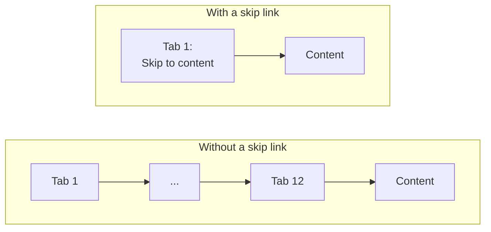

If building this site taught me one thing, it's this: **the enemy isn't the error, it's the silence.** An error tells you where to look. A silent failure leaves you staring at a page that looks fine for days. This third part is about everything that broke without complaining, and how you catch it.

Before this come [part one]({{ '/blog/2026/08/02/como-se-hizo-esta-web-1-tres-mundos/' | relative_url }}), on architecture, and [part two]({{ '/blog/2026/08/02/como-se-hizo-esta-web-2-privacidad-y-papeleo/' | relative_url }}), on privacy and regulation.

## Five failures that gave no warning at all

**Liquid doesn't throw errors: it returns nothing.** Jekyll's template language, faced with a mistyped key, doesn't complain: it returns emptiness. The result is a link with an empty destination, or a blank label. The page builds, ships and is broken. I discovered that an identifier behaved differently with and without quotation marks — without them it was treated as a non-existent variable — by watching an illustration vanish with no explanation whatsoever.

**YAML is case sensitive.** I wrote `jobtitle` in a data file and `jobTitle` in the template. The result was a null value in the page's structured data. Perfectly valid JSON, data lost, zero warnings.

**The filter that was computed and never used.** In the blog listing, the per-profile filter was correctly stored in a variable… and the loop went on iterating over the full collection. The IT blog was also showing Administration articles. Worse still, it was **camouflaged**, because the profile with no articles did show the "nothing here yet" message and the others "showed articles". Everything looked like it worked.

> **Method lesson: check *what* comes out, not just *whether* something comes out.**

**The skip link with no styles.** From day one the site had a "Skip to content" link for keyboard users. The markup was there… and it never had any CSS. For weeks it had been appearing as loose text in the corner of every page and I read straight past it.

**The focus that didn't move.** And once I finally styled it, it still didn't work properly: pressing it scrolled the page down to the content, but keyboard focus stayed at the top. The next tab press sent you back into the header. It looked like it worked. The fix was to let the main element receive focus programmatically.

That last one deserves an explanation, because it's the perfect illustration of why it exists:

The header has around twelve links. Without a skip link, someone navigating by keyboard goes through all of them **on every single page they visit**. That's success criterion 2.4.1, Bypass Blocks, and it's level A: the bare minimum.

The styling has a nice technical twist. A single focus ring will always fail against some background, and there are eight palettes here. The solution was a **double concentric ring**: a light outline with a dark shadow around it. The outline paints on top of the shadow, so one of the two will contrast against any possible background. And it sits above the sticky header, which also covers criterion 2.4.11, Focus Not Obscured, new in version 2.2.

## The audit: twenty reports, and what none of them catches

The target was **WCAG 2.2, level AA**. I did the automated part with axe DevTools against the live site: twenty reports, covering all eight palettes, with the full battery of guided tests — keyboard, forms, structure, images, tables, dialogs, interactive elements. Final result: zero issues.

What had to be fixed along the way:

| Finding | Fix |
|---|---|
| Missing top-level heading on three profiles and on the contact page | Added in both language versions |
| Required fields not explicitly marked for assistive technology | Declared explicitly |
| Skip link with no focus indicator (critical) | The double ring described above |

But something that often goes unsaid is worth saying: **automated tools catch roughly a third of real problems.** The rest has to be seen by a person. That meant:

- **Reflow at 320 pixels wide** across fourteen pages, with no horizontal scrolling and no loss of content.
- **Text-only zoom to 200%.** This uncovered a fault no tool would have caught: as the text grew, so did the sticky header, and the scroll offset reserved for it fell short. Anchors were leaving the heading half hidden.
- **Forced text spacing**, in case someone applies their own stylesheet.
- **A full keyboard pass**: reachability, visible focus, logical order, no traps.
- **The NVDA screen reader**, the most widely used in Europe.

And one criterion **no tool on earth can check**: 3.1.2, Language of Parts. When I leave a Spanish expression untranslated in an English text — say chácaras y tambor, the instruments of a Canary Islands folk group — it has to be marked up as such, or the screen reader will pronounce it using the rules of the wrong language and the braille display will apply contractions that don't belong. No machine knows that an unmarked phrase is in another language. Only someone reading it does. (Yes, that phrase above is marked up. Go and look at the source.)

That's the work still outstanding, and it's why this site's accessibility statement isn't published yet: I'd rather write it when I can say exactly what I've measured.

## Two details I learned from

**Reduced motion.** The site honours the system preference for reduced motion. The interesting part is how: the duration is set to one hundredth of a millisecond, **not to zero**. At zero, some animations never fire at all, and a script waiting for a "transition ended" event waits forever. It's also one of the few places where marking a rule as important is justified: it implements the user's intent, not the developer's.

**The client is never a security boundary.** Character limits, required fields and the form's character counter are convenience, not defence. Anyone who can edit the HTML can edit the JavaScript. The real defence always lives on the server.

## Publishing

The native GitHub Pages builder was no use to me: it's pinned to a much older version of Jekyll and supports neither the bilingual plugin nor modern Sass. That wasn't a preference, it was a constraint: a custom workflow was the only way.

```mermaid
flowchart LR
  accTitle: Automated publishing pipeline for the site
  accDescr {
    Pushing changes to the repository's main branch starts a GitHub Actions run that sets up
    Ruby and installs the dependencies, builds the site in production mode, packages the
    result and deploys it to GitHub Pages, which serves it under the custom domain.
  }
  A["Push to the main branch"] --> B["GitHub Actions"]
  B --> C["Ruby 3.3<br/>and dependency install"]
  C --> D["Build<br/>in production mode"]
  D --> E["Package the site"]
  E --> F["Deploy to GitHub Pages"]
  F --> G["carloslb.com"]
```

Three things I learned there:

**URL and base path are not the same thing.** One key is protocol plus domain; the other is the subfolder within that domain, and it only takes a value if the site doesn't live at the root. Putting the domain in the second one would duplicate the domain in every generated link and break absolutely everything. Before going live, that key was still pointing at my virtual machine's private IP: had I left it, the sitemap and the canonical URLs would have shipped pointing at an address on my local network.

**Intermittent failures are the worst kind.** The bilingual plugin has a documented race condition on continuous integration runners: one process writes into a language directory another hasn't created yet. It fails sometimes. You turn parallelisation off and that's that.

**The last hurdle was daft and highly instructive.** The push was rejected because of the commit's email address. I had fixed the Git configuration, but **configuration only affects future commits**: the one already made kept the old author. You fix it by rewriting the authorship of the pending commit — harmless as long as nothing has been pushed yet.

## What I take away

1. **The silent failure is the enemy.** What isn't complaining isn't fine: it's quiet.
2. **Magic numbers lie.** When a number describes something that can change — an element's width, a header's height — sooner or later it stops being true.
3. **Cohesion prevents errors that discipline doesn't.** Two tags whose relative order matters belong together in one place, not "correctly positioned" separately.
4. **The output folder doesn't always empty itself.** Faced with anything odd: stop, empty, start again, and *then* diagnose. I lost an afternoon chasing a ghost path left over from an earlier build.
5. **Check the source before asserting.**

That last one deserves to close the series, because it ties back to what I said in part one about working with an AI assistant. It got things wrong three times in the same way: asserting with confidence something inferred from an incomplete source — a truncated file listing, an out-of-date copy of the project, a filename cut short by length. On one of those occasions it even corrected me when I was right.

I caught all three because I know my own project and because something didn't sit right. And that's exactly the same lesson as the rest of the article: **a confident, wrong answer is a silent failure too.** It throws no error. It sounds good. And it needs checking just like a loop that "shows articles".

Whoever gives you an answer, go and look at the source.

---

The code for all of this is at [github.com/carloslb-com/carloslb-com.github.io](https://github.com/carloslb-com/carloslb-com.github.io). If anything here is useful to you, take it. And if you run into an accessibility barrier on this site, [get in touch]({{ '/contact/' | relative_url }}): I'd rather know than be right.
