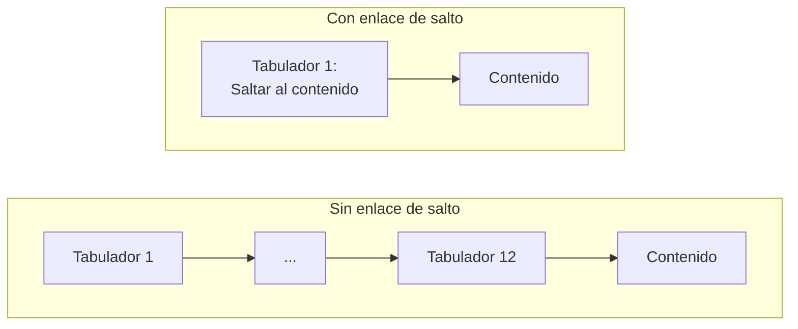
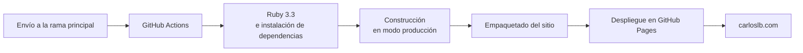

Si algo he aprendido montando este sitio es esto: **el enemigo no es el error, es el silencio.** Un error te dice dónde mirar. Un fallo silencioso te deja mirando una página que parece correcta durante días. Esta tercera parte va de todo lo que se rompió sin quejarse, y de cómo se caza.

Antes están la [primera parte]({{ '/blog/2026/08/02/como-se-hizo-esta-web-1-tres-mundos/' | relative_url }}), sobre arquitectura, y la [segunda]({{ '/blog/2026/08/02/como-se-hizo-esta-web-2-privacidad-y-papeleo/' | relative_url }}), sobre privacidad y normativa.

## Cinco fallos que no dieron ni un aviso

**Liquid no lanza errores: devuelve vacío.** El lenguaje de plantillas de Jekyll, ante un dato mal escrito, no se queja: devuelve nada. El resultado es un enlace con destino vacío, o un rótulo en blanco. La página se genera, se publica y está rota. Descubrí que un identificador entre comillas y sin comillas se comportaban distinto —sin comillas, lo trataba como una variable inexistente— viendo desaparecer una ilustración sin explicación alguna.

**YAML distingue mayúsculas.** Escribí `jobtitle` en un archivo de datos y `jobTitle` en la plantilla. El resultado fue un dato nulo en los datos estructurados de la página. JSON perfectamente válido, dato perdido, cero avisos.

**El filtro que se calculaba y no se usaba.** En el listado del blog, el filtro por perfil se guardaba correctamente en una variable… y el bucle seguía recorriendo la colección completa. El blog de IT mostraba también los artículos de Administración. Lo peor: estaba **camuflado**, porque el perfil que no tenía artículos sí mostraba el mensaje de «aún no hay nada» y los demás «mostraban artículos». Todo parecía funcionar.

> **Lección de método: comprobar *qué* sale, no solo *si* sale.**

**El enlace de salto sin estilos.** El sitio tenía desde el primer día un enlace «Saltar al contenido» para quien navega con teclado. El marcado estaba… y nunca tuvo CSS. Llevaba semanas apareciendo como un texto suelto en la esquina de todas las páginas y yo lo leía sin verlo.

**El foco que no se movía.** Y cuando por fin le puse estilos, seguía sin funcionar bien: al pulsarlo, la página bajaba hasta el contenido pero el foco del teclado se quedaba arriba. El siguiente tabulador te devolvía a la cabecera. Parecía que funcionaba. La cura fue permitir que el elemento principal pudiera recibir el foco por programa.

Este último merece explicación, porque es el ejemplo perfecto de por qué existe:

La cabecera tiene unos doce enlaces. Sin enlace de salto, alguien que navega con teclado los atraviesa **en cada página que visita**. Es el criterio 2.4.1 de las pautas de accesibilidad, y es nivel A: el mínimo.

El estilo tiene su gracia técnica. Un solo anillo de foco falla siempre contra algún fondo, y aquí hay ocho paletas. La solución fue un **doble anillo concéntrico**: un contorno claro y una sombra oscura alrededor. El contorno se pinta por encima de la sombra, así que uno de los dos contrasta contra cualquier fondo posible. Y va por encima de la cabecera fija, lo que cubre además el criterio 2.4.11, «Foco no oscurecido», nuevo en la versión 2.2.

## La auditoría: veinte informes y lo que ninguno detecta

El objetivo era **WCAG 2.2, nivel AA**. La parte automatizada la hice con axe DevTools sobre el sitio ya publicado: veinte informes, con las ocho paletas cubiertas y la batería completa de pruebas guiadas —teclado, formularios, estructura, imágenes, tablas, diálogos, elementos interactivos—. Resultado final: cero incidencias.

Lo que hubo que corregir por el camino:

| Hallazgo | Solución |
|---|---|
| Faltaba el encabezado principal en tres perfiles y en contacto | Añadido en las versiones de los dos idiomas |
| Campos obligatorios sin marcar explícitamente para tecnologías de apoyo | Declarados de forma explícita |
| Enlace de salto sin indicador de foco (crítico) | El doble anillo de arriba |

Pero conviene decir una cosa que se calla mucho: **las herramientas automáticas detectan alrededor de un tercio de los problemas reales.** El resto lo tiene que ver una persona. Eso significó:

- **Redistribución a 320 píxeles de ancho** en catorce páginas, sin barra horizontal ni pérdida de contenido.
- **Ampliar solo el texto al 200 %.** Esto destapó un fallo que ninguna herramienta habría visto: al crecer el texto crecía la cabecera fija, y el desplazamiento reservado para ella se quedaba corto. Los anclajes dejaban el título medio tapado.
- **Espaciado de texto forzado**, por si alguien usa su propia hoja de estilos.
- **Recorrido completo de teclado**: alcance, foco visible, orden lógico, sin trampas.
- **Lector de pantalla NVDA**, el más usado en Europa.

Y un criterio que **ninguna herramienta del mundo puede comprobar**: el 3.1.2, «Idioma de las partes». Cuando en el texto en inglés dejo una expresión en español sin traducir, hay que marcarla como tal, o el lector de pantalla la pronunciará con las reglas del idioma equivocado y la línea braille aplicará contracciones que no tocan. Ninguna máquina sabe que una frase sin marcar está en otro idioma. Eso solo lo ve alguien leyendo. Es el trabajo que queda pendiente, y por eso el compromiso de accesibilidad de este sitio todavía no está publicado: prefiero escribirlo cuando pueda decir exactamente qué he medido.

## Dos detalles de los que aprendí

**Movimiento reducido.** El sitio respeta la preferencia del sistema de reducir animaciones. El detalle está en cómo: la duración se pone en una centésima de milisegundo, **no en cero**. Con cero, algunas animaciones no llegan a dispararse, y un guion que espere el aviso de «animación terminada» se queda esperando para siempre. Además es de los pocos sitios donde marcar una regla como prioritaria está justificado: implementa la voluntad del usuario, no la del desarrollador.

**El cliente nunca es frontera de seguridad.** El límite de caracteres, los campos obligatorios y el contador del formulario son comodidad, no defensa. Quien puede editar el HTML puede editar el JavaScript. La defensa real está siempre en el servidor.

## Publicar

El constructor nativo de GitHub Pages no me servía: está fijado a una versión de Jekyll muy anterior y no admite ni el complemento de bilingüismo ni el Sass moderno. No fue una preferencia, fue una obligación: hacía falta un flujo de trabajo propio.

Tres cosas que aprendí ahí:

**Dirección y subcarpeta no son lo mismo.** Una clave es protocolo más dominio; la otra es la subcarpeta dentro del dominio, y solo lleva valor si el sitio no vive en la raíz. Poner el dominio en la segunda duplicaría el dominio en cada enlace generado y rompería absolutamente todo. Antes de publicar, esa clave apuntaba a la IP privada de mi máquina virtual: de haberlo dejado así, el mapa del sitio y las direcciones canónicas se habrían publicado apuntando a una dirección de mi red local.

**Los fallos intermitentes son los peores.** El complemento de bilingüismo tiene una condición de carrera documentada en los servidores de integración: un proceso escribe en un directorio de idioma que otro aún no ha creado. Falla a veces. Se desactiva la paralelización y se acabó.

**El último escollo fue tonto y muy instructivo.** El envío se rechazaba por el correo del commit. Había corregido la configuración de Git, pero **la configuración solo afecta a los commits futuros**: el que ya estaba hecho conservaba el autor antiguo. Se resuelve reescribiendo la autoría del commit pendiente, algo inofensivo mientras no se haya subido nada.

## Lo que me llevo

1. **El fallo silencioso es el enemigo.** Lo que no se queja no está bien: está callado.
2. **Los números mágicos mienten.** Cuando un número describe algo que puede cambiar —el ancho de un elemento, la altura de una cabecera—, tarde o temprano deja de ser cierto.
3. **La cohesión previene errores que la disciplina no previene.** Dos etiquetas cuyo orden importa entre sí van juntas en el mismo sitio, no «bien colocadas» por separado.
4. **La carpeta de salida no siempre se vacía sola.** Ante cualquier rareza: parar, vaciar, arrancar de nuevo y *entonces* diagnosticar. Perdí una tarde persiguiendo una ruta fantasma de una construcción anterior.
5. **Verificar en la fuente antes de afirmar.**

Ese último merece cerrar la serie, porque enlaza con lo que conté en la primera parte sobre trabajar con un asistente de IA. Se equivocó tres veces de la misma manera: afirmando con seguridad algo deducido de una fuente incompleta —un listado de archivos truncado, una copia desactualizada del proyecto, un nombre de fichero cortado por longitud—. En una de ellas llegó a corregirme cuando yo tenía razón.

Las tres las cacé porque conocía mi propio proyecto y porque algo no me cuadraba. Y esa es exactamente la misma lección que el resto del artículo: **una respuesta segura y falsa es también un fallo silencioso.** No da error. Suena bien. Y hay que comprobarla igual que se comprueba un bucle que «muestra artículos».

Sea quien sea quien te dé una respuesta, la fuente se mira.

---

El código de todo esto está en [github.com/carloslb-com/carloslb-com.github.io](https://github.com/carloslb-com/carloslb-com.github.io). Si algo de aquí te sirve, te lo llevas. Y si encuentras una barrera de accesibilidad en el sitio, [escríbeme]({{ '/contact/' | relative_url }}): me interesa más saberlo que tener razón.
